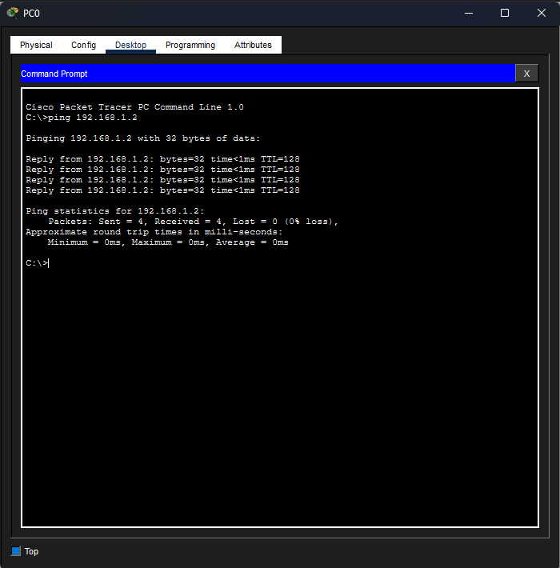

## Лабораторная работа 1: Базовая локальная сеть (Packet Tracer)

### Цель
Создать простую локальную сеть и проверить соединение между двумя хостами.

---

## Сетевая топология

---

## Конфигурация IP

PC0: 192.168.1.1 
PC1: 192.168.1.2 

---

## Проверка (тест Ping)

---

## Продемонстрированные навыки
- Базовая IP-адресация
- Настройка локальной сети в Cisco Packet Tracer
- Проверка соединения с использованием ICMP (ping)
