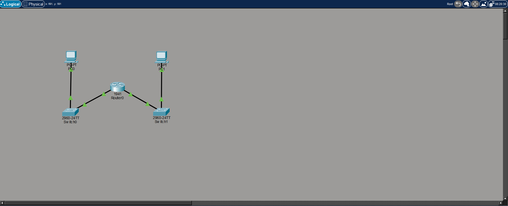
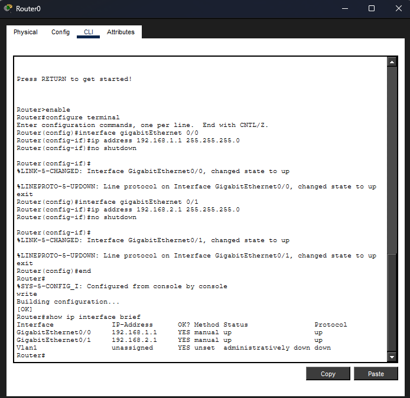
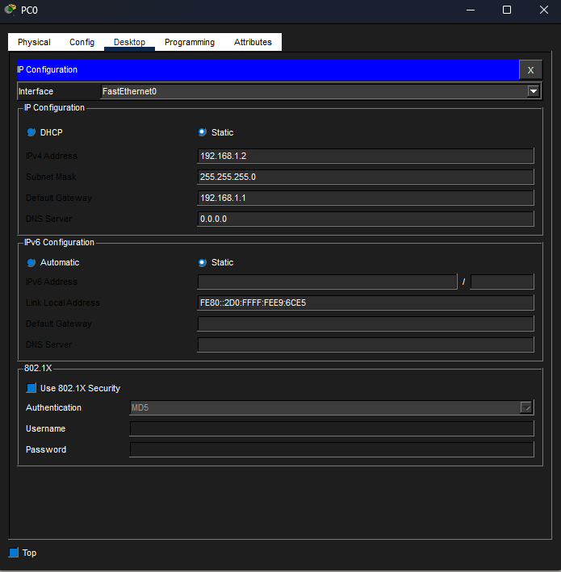
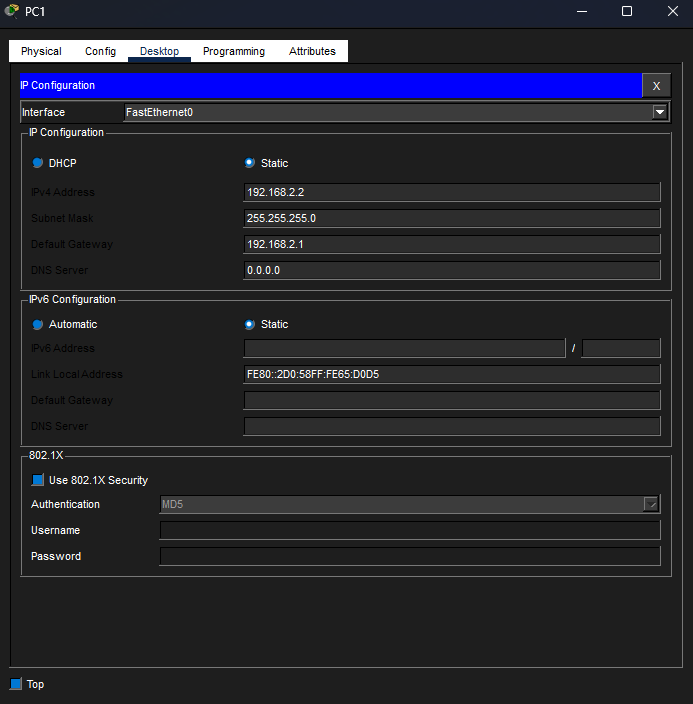
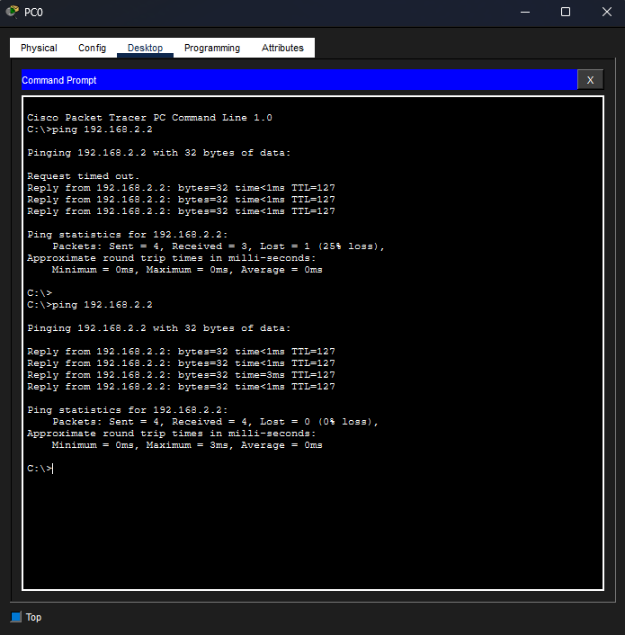

## Lab 1: Basic LAN Network (Packet Tracer)

### Objective
Build a simple LAN network and verify connectivity between two PCs.

---

## Network Topology

---

## IP Configuration
PC0: 192.168.1.1  
PC1: 192.168.1.2  

---

## Connectivity Test
Ping between hosts:

---

## Result
- Devices are in the same subnet (192.168.1.0/24)
- Successful ICMP communication between hosts
- Switch forwards frames correctly at Layer 2

## Result

The LAN network is fully operational:
- Both PCs are in the same subnet (192.168.1.0/24)
- ICMP ping is successful
- Switch correctly forwards traffic between hosts

## Лабораторная работа 2: Маршрутизатор и межсетевое взаимодействие

### Цель
Настроить маршрутизацию между двумя различными локальными сетями с помощью маршрутизатора.

---

## Сетевая топология

*Рисунок 1: Сетевая топология с двумя локальными сетями, соединенными через маршрутизатор*
---

## Конфигурация маршрутизатора

*Рисунок 2: Конфигурация интерфейса маршрутизатора с назначенными IP-адресами для обеих сетей*
---

## Конфигурация PC0

*Рисунок 3: IP-конфигурация PC0 в сети 192.168.1.0/24*
---

## Конфигурация PC1

*Рисунок 4: IP-конфигурация ПК1 в сети 192.168.2.0/24*
---

## Проверка подключения

*Рисунок 5: Успешный ICMP-пинг между PC0 и PC1 в разных сетях*
---

## Результат
- Настроены две отдельные локальные сети
- Маршрутизатор успешно выполняет межсетевую маршрутизацию
- ICMP-связь между подсетями работает

## Продемонстрированные навыки
- Базовая настройка локальной сети
- IP-адресация (IPv4)
- Основы статической маршрутизации
- Моделирование в Cisco Packet Tracer
- Устранение неполадок в сети (ping, ARP)
