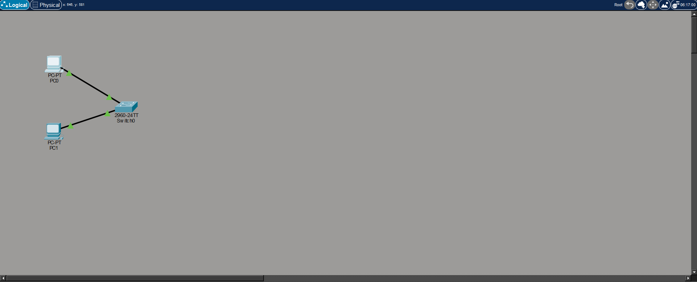
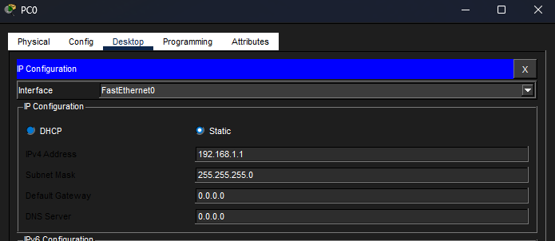

## Лабораторная работа 1: Базовая локальная сеть (Packet Tracer)

### Цель
Создать простую локальную сеть и проверить связь между двумя ПК.

---

## Топология сети

---

## Настройка IP-адресов
PC0: 192.168.1.1
PC1: 192.168.1.2 

---

## Проверка подключения
Пинг между хостами:

---

## Результат
- Устройства находятся в одной подсети (192.168.1.0/24)
- Успешная ICMP-связь между хостами
- Коммутатор корректно пересылает кадры на уровне 2

## Результат

Локальная сеть полностью работоспособна:
- Оба ПК находятся в одной подсети (192.168.1.0/24)
- ICMP-пинг пройден успешно
- Коммутатор корректно пересылает трафик между хостами
