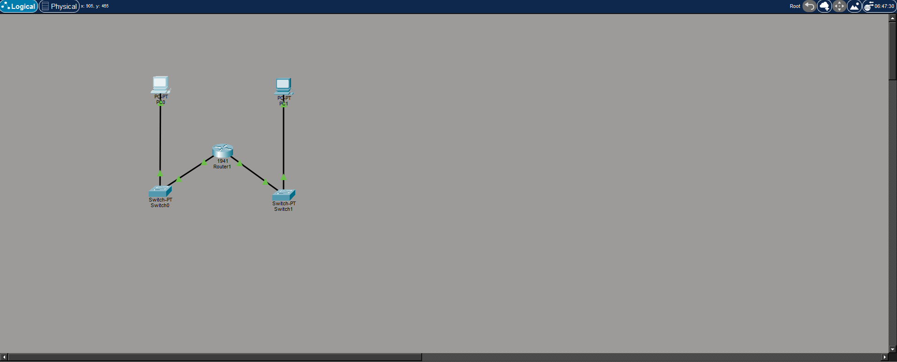
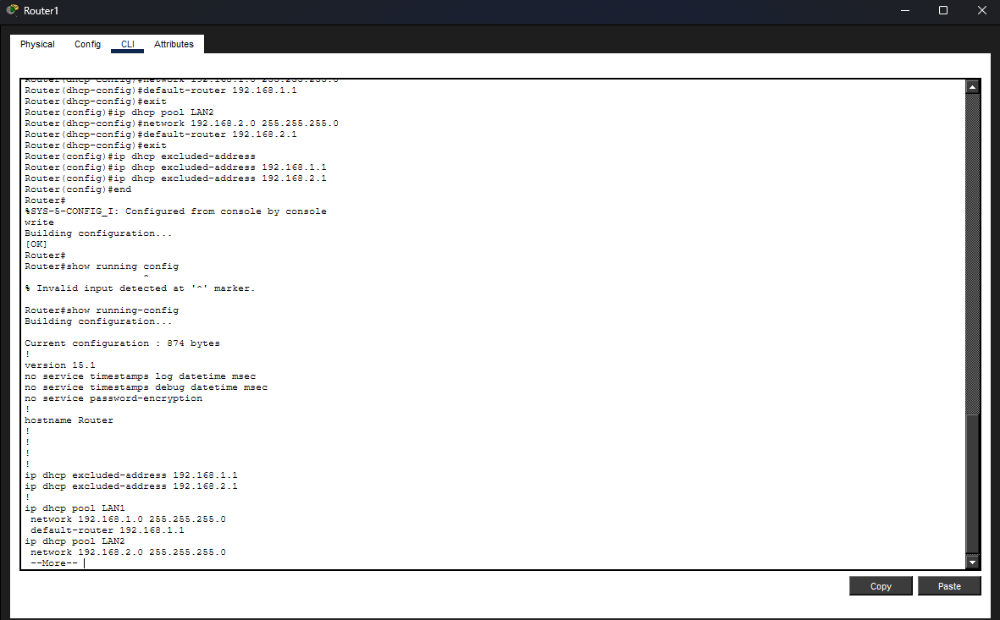
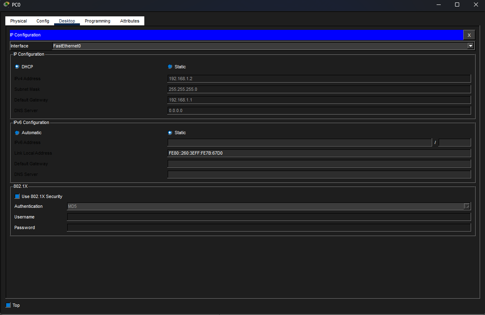
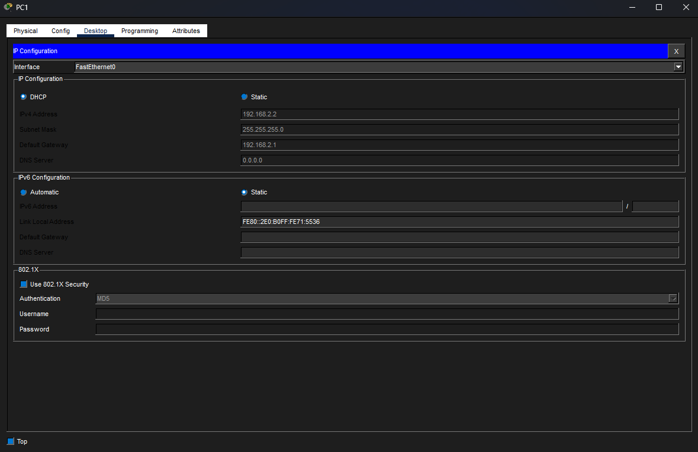
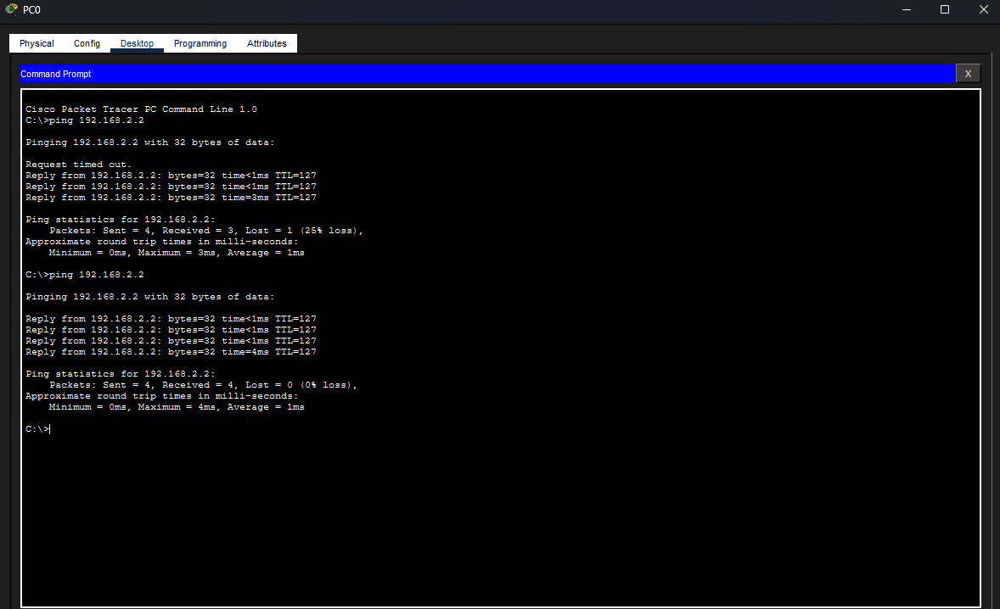

# Lab 3 - DHCP Network Configuration

## Цель
Настроить маршрутизатор в качестве DHCP-сервера для автоматического назначения IP-адресов устройствам в двух разных локальных сетях.

--

## Используемые технологии
- Cisco Packet Tracer
- DHCP
- IPv4
- Маршрутизатор
- Коммутатор
- ICMP (Ping)

---

## Сетевая топология

*Рисунок 1: Топология сети с конфигурацией DHCP на основе маршрутизатора*

---

## Настройка DHCP маршрутизатора

*Рисунок 2: Пулы DHCP, настроенные на маршрутизаторе для обеих локальных сетей*

---

## Конфигурация DHCP для PC0

*Рисунок 3: ПК0 автоматически получает IP-конфигурацию от DHCP-сервера*

---

## Конфигурация DHCP для ПК1

*Рисунок 4: ПК1 автоматически получает IP-конфигурацию от DHCP-сервера*

---

## Тест подключения

*Рисунок 5: Успешная ICMP-связь между хостами в разных сетях*

---

## Результат
- Маршрутизатор настроен как DHCP-сервер
- Автоматическое назначение IP-адресов работает корректно
- Межсетевое взаимодействие успешно
- Пулы DHCP успешно распределяют настройки шлюза и сети

---

## Продемонстрированные навыки
- Настройка DHCP
- Настройка интерфейсов маршрутизатора
- Адресация IPv4
- Устранение неполадок в сети
- Межсетевая маршрутизация
- Интерфейс командной строки Cisco IOS
