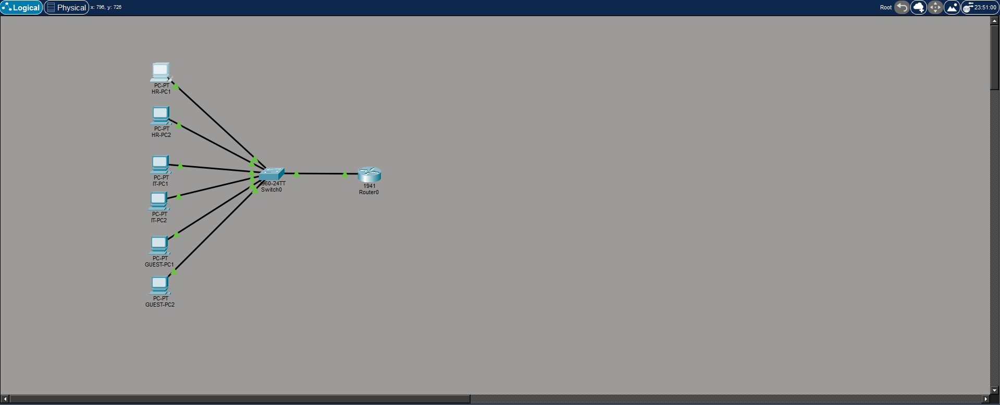
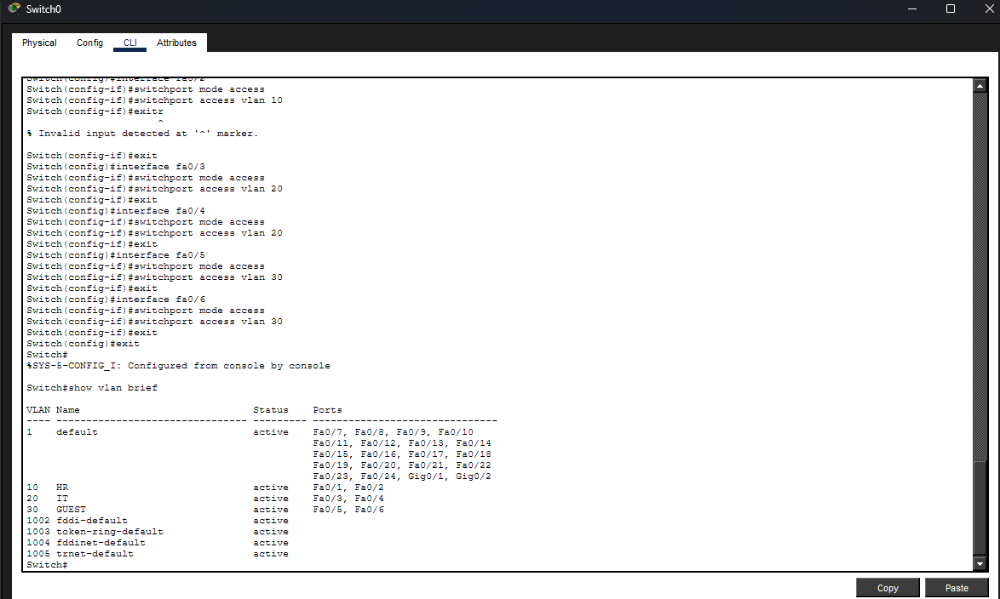
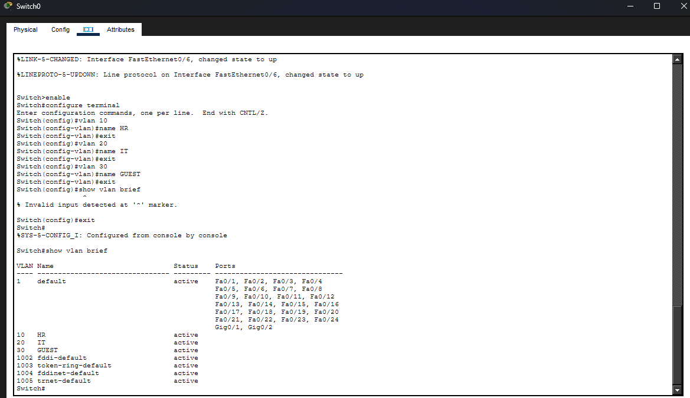
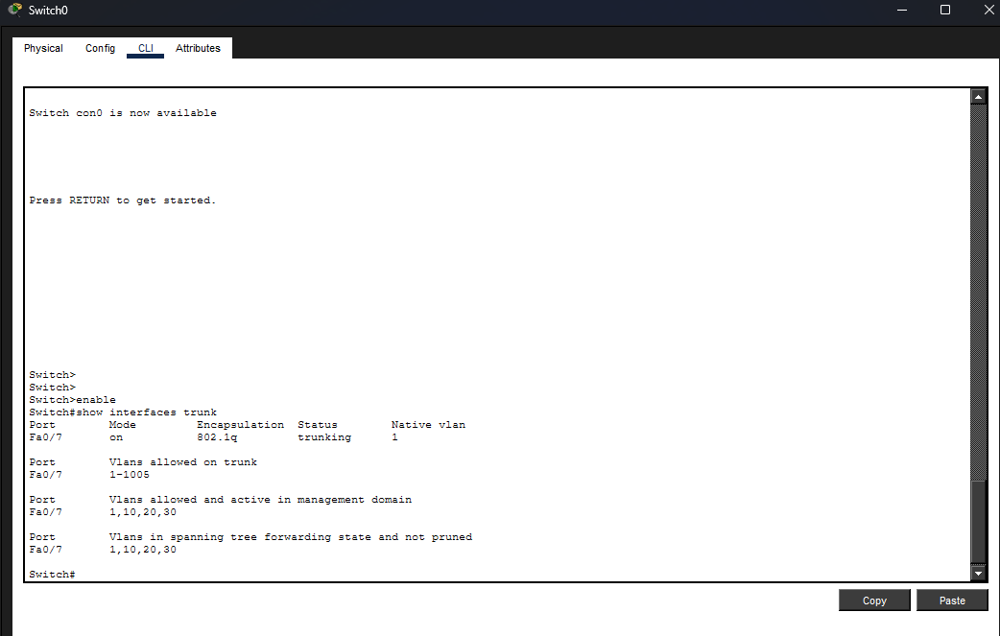
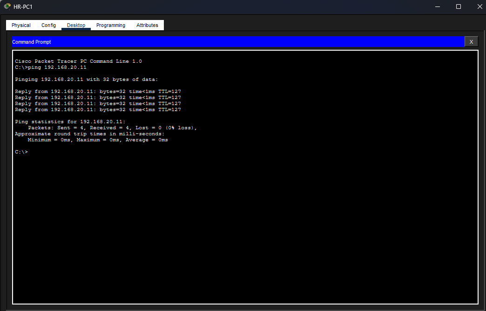
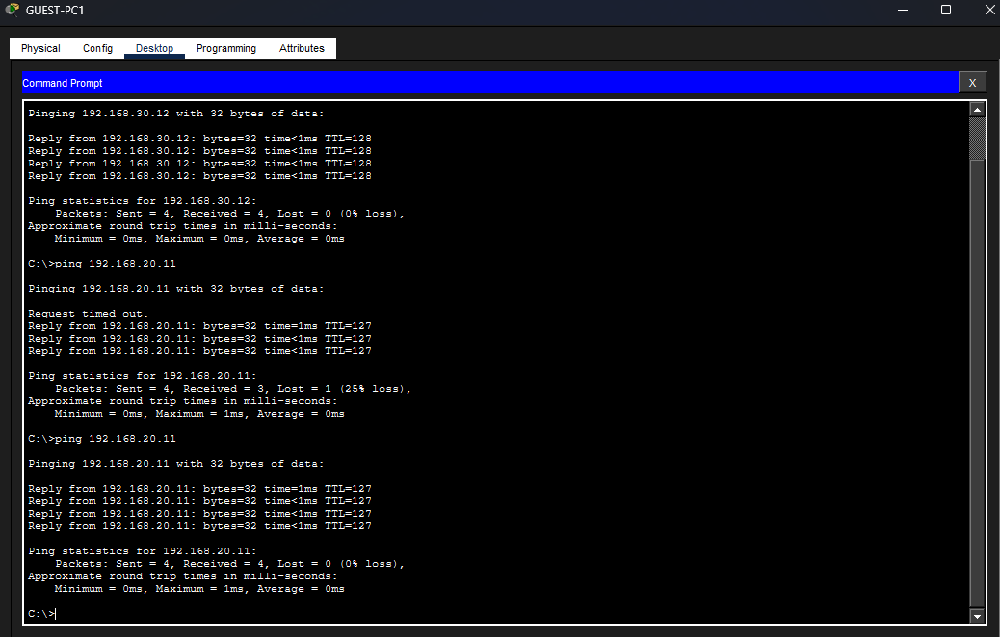

# Lab 04 - VLAN Segmentation & Inter-VLAN Routing

## Цель
В этой лабораторной работе демонстрируется сегментация VLAN и маршрутизация между VLAN с использованием топологии «маршрутизатор на одном устройстве» в Cisco Packet Tracer.

---

## Сетевая топология

---

## Настройка VLAN

| VLAN | Name   | Network         |
|------|--------|----------------|
| 10   | HR     | 192.168.10.0/24 |
| 20   | IT     | 192.168.20.0/24 |
| 30   | GUEST  | 192.168.30.0/24 |

---

## План IP-адресации

### VLAN для HR
- 192.168.10.11
- 192.168.10.12
- Шлюз: 192.168.10.1

### VLAN для IT
- 192.168.20.11
- 192.168.20.12
- Шлюз: 192.168.20.1

### VLAN для GUEST
- 192.168.30.11
- 192.168.30.12
- Шлюз: 192.168.30.1

---

## Сводка конфигурации
## Конфигурация коммутатора

### Коммутатор
- Создание VLAN (10, 20, 30)
- Назначение портов для каждого VLAN
- Конфигурация транка на Fa0/7

### Маршрутизатор
- Конфигурация Router-on-a-stick
- Субинтерфейсы:

- g0/0.10

- g0/0.20

- g0/0.30

---

## Проверка транка

---

## Результаты тестирования
## Тестирование

### HR ↔ IT

### Тесты ГОСТЯ

---

## Основные выводы
- Сегментация VLAN
- Транкинг 802.1Q
- Маршрутизация между VLAN (маршрутизатор на одном устройстве)
- Сетевая изоляция и контролируемая связь

---

## Включенные файлы
- Проект Packet Tracer (.pkt)
- Конфигурации коммутаторов и маршрутизаторов
- Скриншоты топологии и тестов
