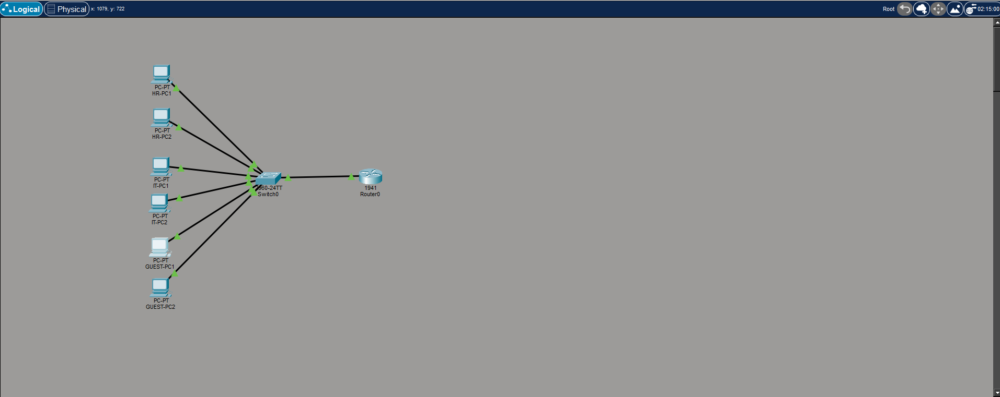
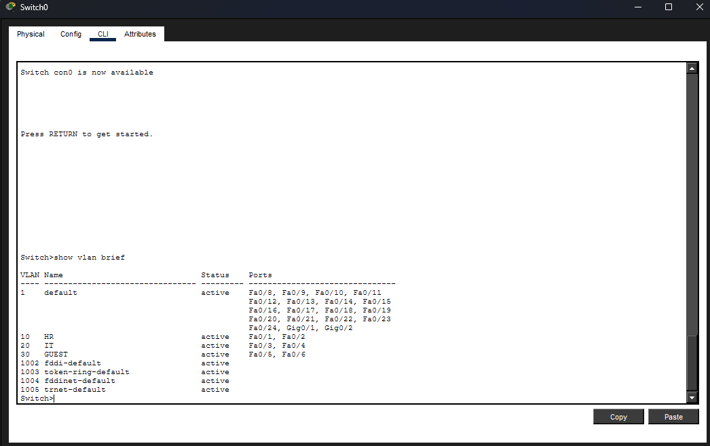
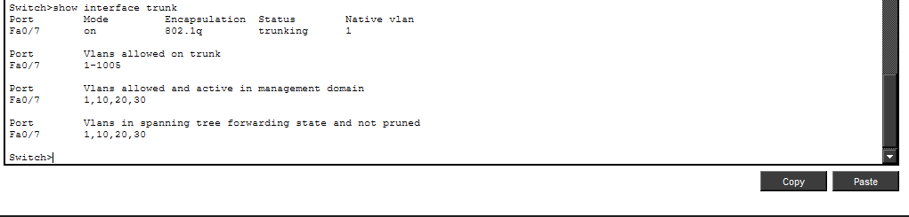
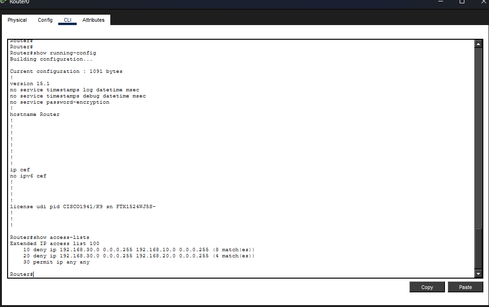
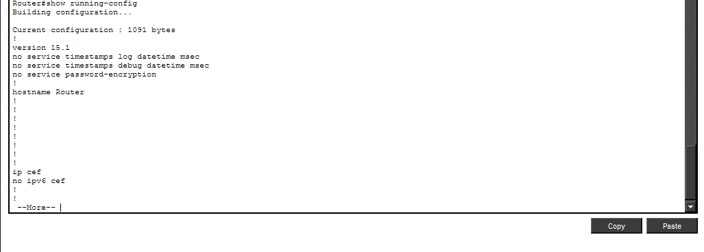
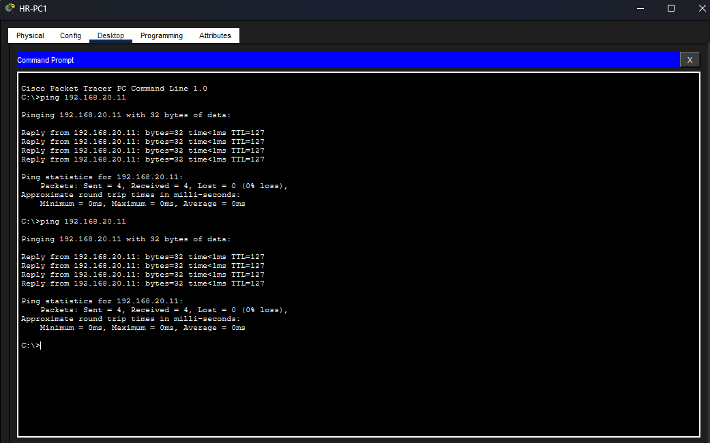
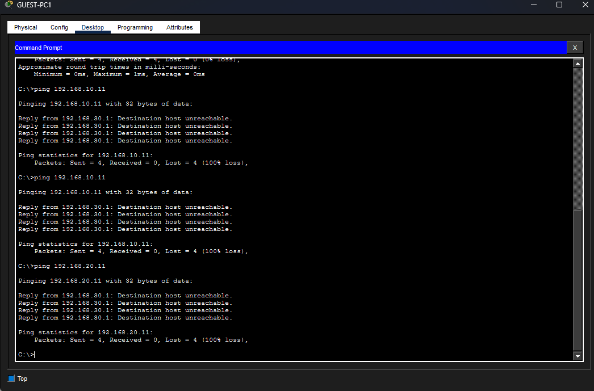

# Lab 05 - ACL Security Between VLANs

# Цель
В этой лабораторной работе демонстрируется сегментация VLAN и фильтрация трафика с использованием списков контроля доступа (ACL) в Cisco Packet Tracer.

---

## Сетевая топология

---

## Настройка VLAN

---

## Конфигурация транка

---

## Настройка ACL

---

## Конфигурация маршрутизатора

---
## Политика трафика

| Исходная VLAN | Целевая VLAN | Действие |

|---|---|---|

| ГОСТЬ | HR | Запрещено |

| ГОСТЬ | IT | Запрещено |

| HR | IT | Разрешено |

| IT | HR | Разрешено |

## Результаты тестирования

### ✔ Разрешенный трафик
Связь между HR и IT работает успешно.

---

### Заблокированный трафик
Гостевая VLAN заблокирована для доступа к VLAN отдела кадров и ИТ.

---

## Ключевые выводы
- Сегментация VLAN
- Транкинг 802.1Q
- Маршрутизация Router-on-a-Stick
- Основы сетевой безопасности

## Используемые технологии

- Cisco Packet Tracer
- VLAN
- Транкинг 802.1Q
- Расширенные списки контроля доступа (ACL)
- Маршрутизация Router-on-a-Stick
